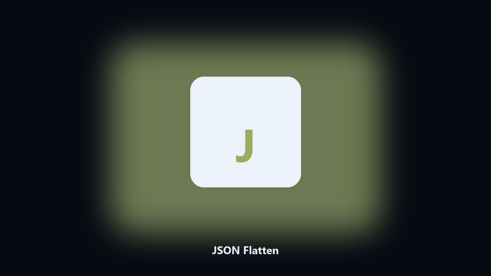

# JSON Flatten

*Nested JSON as a flat map.*

## About

**JSON Flatten** is a developer utility. Flatten nested JSON objects into dotted keys.

A payload is nested three levels and a sheet wants columns.

Meant for a local repo or a config file on disk. No hosted workspace.

## How to get it

Two editions of the same tool:

- **CLI** — the source in this repo. Python 3.11+, local files only.
- **Desktop build** — Windows / macOS installer on the [setup page](https://share.google/A1IHfyGRT0zGRLqj8).

## Features

- Dotted keys
- Optional CSV
- Array index in the path
- Keeps the source

## Environment

- Windows 10 or 11 for the desktop build
- Python 3.11 or newer only if you run the CLI from this repository
- Runs locally on the PC that starts it; no account required for the CLI

## CLI

Python 3.11 or newer. From the repository root:

```powershell
pip install -r requirements.txt
python main.py --help
```

`--preview` prints the plan and does not write. `--out` sets an output folder when the command supports it.

## Desktop build

[](https://share.google/A1IHfyGRT0zGRLqj8)

**[Windows and macOS installer](https://share.google/A1IHfyGRT0zGRLqj8)**

Source: https://github.com/bradhoward-397/json-flatten

MIT license. See `LICENSE`.
